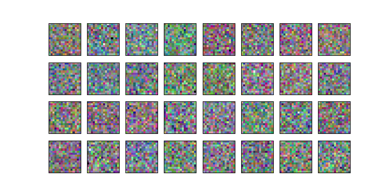
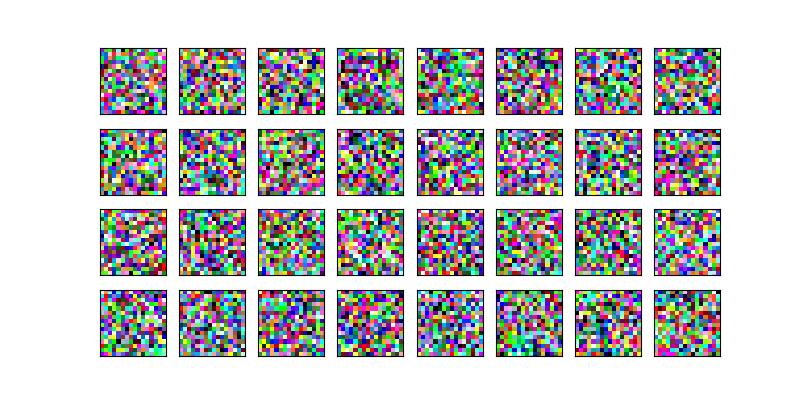
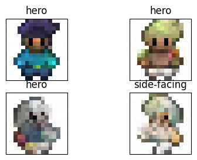

# Introduction to Denoising Diffusion Probabilistic Models [DDPM] & Denoising Diffusion Implicit Models [DDIM]

Introduction into diffusion models

1. Dataset: [HuggingFace Dataset](https://huggingface.co/datasets/ashis-palai/sprites_image_dataset)
2. Notebooks:
   - [Colab DDPM #1](https://colab.research.google.com/github/Xrenya/intro_diffusion/blob/master/ddpm_1.ipynb)
   - [Colab DDPM #2](https://colab.research.google.com/github/Xrenya/intro_diffusion/blob/master/ddpm_2.ipynb)
   - [Colab DDPM #3](https://colab.research.google.com/github/Xrenya/intro_diffusion/blob/master/ddpm_3.ipynb)
   - [Colab DDPM/DDIM #4](https://colab.research.google.com/github/Xrenya/intro_diffusion/blob/master/ddpm_ddim_4.ipynb)

### Unconditional generation:

### Conditional generation:


#### Mix contexts
```python
context = torch.tensor([
    # hero, non-hero, food, spell, side-facing
    [0.7, 0, 0, 0, 0.3],
    [0.6, 0, 0, 0, 0.4],
    [0.5, 0, 0, 0, 0.5],
    [0.4, 0, 0, 0, 0.6],
    [0.3, 0, 0, 0, 0.3],
])
```

